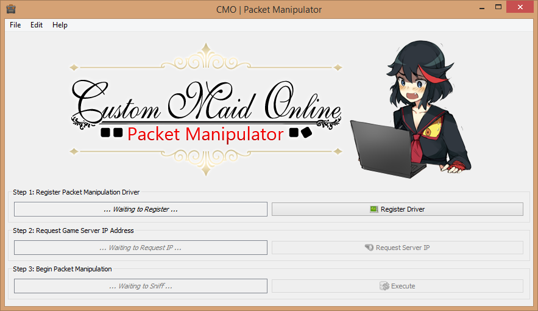

CMOPM
---
Custom Maid Online Packet Manipulator (CMOPM) is a tool to play with the packet flow of the custom maid online program.



 Before you Get Started
---
1. This program is currently in **flux**, and will be unstable from commit to commit
2. When a stable verion is released, it will be linked here

Roadmap
---

 - [x] Intercept login process, log XOR32 Seed handshake
 - [x] Reverse engineer and decrypt XOR32 packet encryption on the wire
 - [x] Monitor and log packet flow between client and server
 - [ ] Allow dropping incoming and outgoing packets
 - [ ] Allow spoofing server and client packets
 - [ ] Allow altering packets on the wire (Due to checksum, requires building all new packet)

Windows Binaries
---

> Once a release version is reached, standalone *.exe's packaged by pyInstaller will be linked here

_Currently None_

Getting Started
---
> Be sure to install the required dependencies **listed below** before running this program

Pull down the code and execute run.py:

```> python.exe run.py```

Dependencies
---
This program uses the following libraries:

 - [Python 2.7.x](https://www.python.org/)
 - [PyQt4](http://www.riverbankcomputing.com/software/pyqt/intro)
 - [Python Requests](http://docs.python-requests.org/en/latest/)
 - [WinDivert 1.1](http://reqrypt.org/windivert.html)
 - [pyDivert](https://github.com/ffalcinelli/pydivert)
 - [PyInstaller](http://www.pyinstaller.org/)

Contribute, Ask for help, report an issue
---
You can do all of this using the respective Github services

 - Contribute via [pull requests](https://help.github.com/articles/using-pull-requests)
 - Ask for help by [creating an issue](https://github.com/ashbyb/cmopm/issues/new) and [labeling it](https://help.github.com/articles/customizing-issue-labels) as a question
 - Report an issue by [creating one](https://github.com/ashbyb/cmopm/issues/new)

Why make this software?
---
As a Computer Science major I love breaking things as a weekend project.

License
---
<a rel="license" href="http://creativecommons.org/licenses/by-nc-sa/4.0/"></a><br />This work is licensed under a <a rel="license" href="http://creativecommons.org/licenses/by-nc-sa/4.0/">Creative Commons Attribution-NonCommercial-ShareAlike 4.0 International License</a>.

Legal
---
THIS SOFTWARE IS PROVIDED BY THE COPYRIGHT HOLDERS AND CONTRIBUTORS "AS IS" AND ANY EXPRESS OR IMPLIED WARRANTIES, INCLUDING, BUT NOT LIMITED TO, THE IMPLIED WARRANTIES OF MERCHANTABILITY AND FITNESS FOR A PARTICULAR PURPOSE ARE DISCLAIMED. IN NO EVENT SHALL THE COPYRIGHT OWNER OR CONTRIBUTORS BE LIABLE FOR ANY DIRECT, INDIRECT, INCIDENTAL, SPECIAL, EXEMPLARY, OR CONSEQUENTIAL DAMAGES (INCLUDING, BUT NOT LIMITED TO, PROCUREMENT OF SUBSTITUTE GOODS OR SERVICES; LOSS OF USE, DATA, OR PROFITS; OR BUSINESS INTERRUPTION) HOWEVER CAUSED AND ON ANY THEORY OF LIABILITY, WHETHER IN CONTRACT, STRICT LIABILITY, OR TORT (INCLUDING NEGLIGENCE OR OTHERWISE) ARISING IN ANY WAY OUT OF THE USE OF THIS SOFTWARE, EVEN IF ADVISED OF THE POSSIBILITY OF SUCH DAMAGE.
